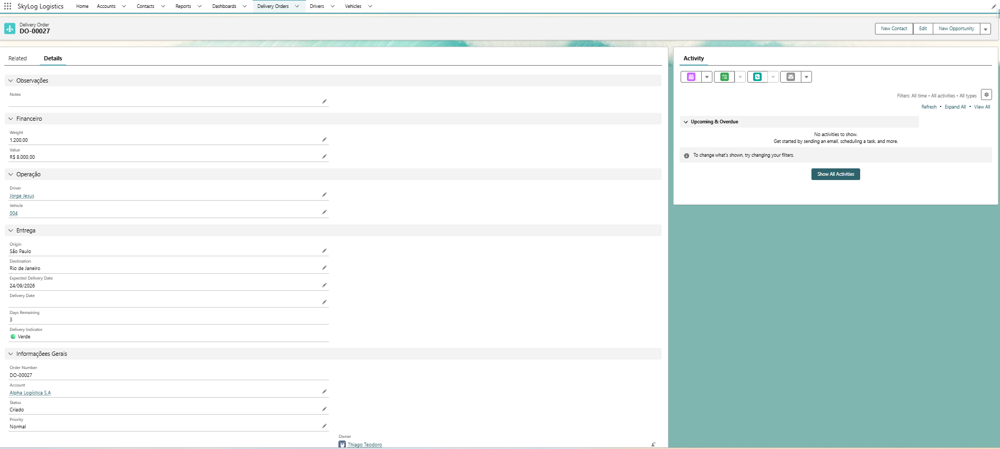
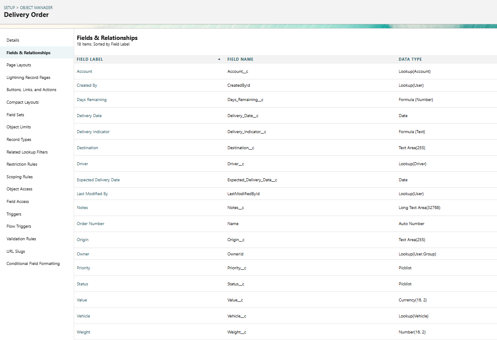
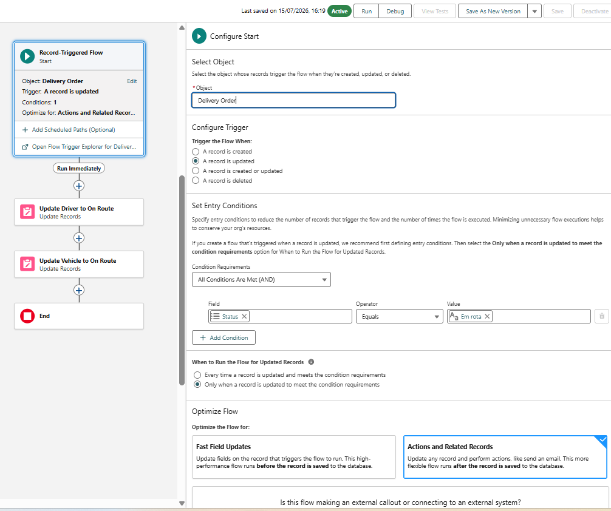
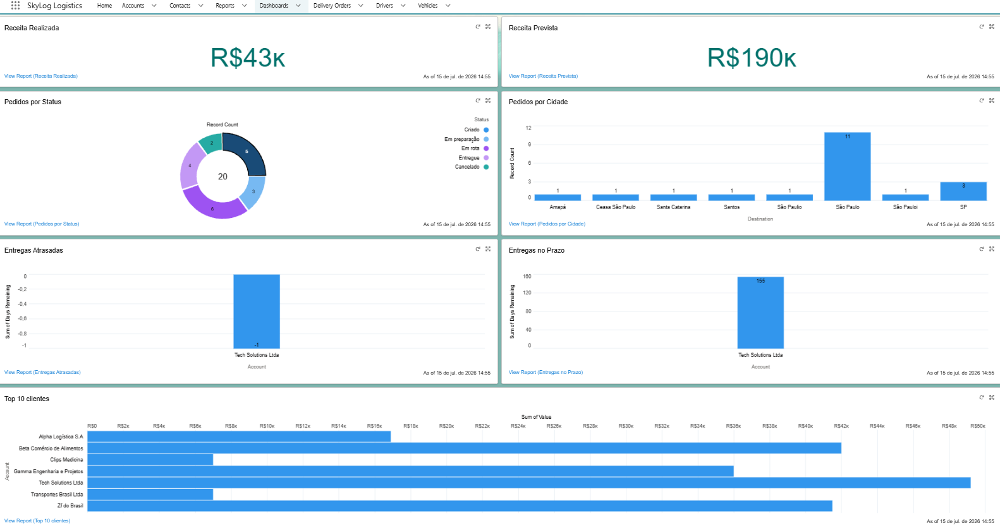

# 🚚 SkyLog Logistics

## Projeto Salesforce — Sistema de Gestão Logística

O **SkyLog Logistics** é um projeto desenvolvido em Salesforce para simular a implementação de um sistema de gestão logística, centralizando informações de clientes, pedidos, motoristas e veículos em uma única plataforma.

O projeto foi desenvolvido com foco em **modelagem de dados, automação de processos, regras de negócio, indicadores e desenvolvimento Apex**.

---

## 🎯 Objetivo

Criar um MVP para uma empresa de logística que anteriormente dependia de planilhas, e-mails e outros processos manuais.

A solução busca centralizar a operação e facilitar o acompanhamento de pedidos, entregas e indicadores.

---

## 🏗️ Principais recursos

### 👥 Gestão de clientes

* Cadastro de empresas utilizando `Account`
* Cadastro de contatos utilizando `Contact`
* Organização das informações dos clientes
* Relacionamento entre clientes e pedidos

### 📦 Gestão de pedidos

Foi criado o objeto customizado `Delivery_Order__c` para representar as entregas.

O processo contempla:

* Número do pedido
* Cliente
* Status
* Prioridade
* Motorista
* Veículo
* Origem e destino
* Data prevista de entrega
* Data de entrega
* Valor e peso
* Observações
* Indicadores de prazo

#### Exemplo de Delivery Order

A tela centraliza as principais informações operacionais da entrega, incluindo cliente, motorista, veículo, rota, valores, prazo e indicador de entrega.



### 🗂️ Modelagem de dados

O objeto `Delivery_Order__c` utiliza campos customizados, relacionamentos Lookup, Picklists, campos de data, valores numéricos e fórmulas para representar as informações necessárias ao processo logístico.



### 🚛 Motoristas e veículos

O sistema possui estruturas específicas para gerenciamento de:

* Motoristas
* Veículos
* Disponibilidade
* Atribuição de recursos às entregas

### ⚙️ Regras de negócio

Foram implementadas regras para controlar o processo de entrega, incluindo:

* Validação de peso e valor
* Controle da evolução dos status
* Regras para início de rota
* Associação de motorista e veículo
* Preenchimento automático da data de entrega

### 🔄 Automação com Flow

Flows foram utilizados para automatizar processos da operação.

O Flow `DO_Start_Route` é acionado quando uma `Delivery Order` entra no status **Em rota**, atualizando automaticamente o motorista e o veículo relacionados.



### 📊 Relatórios e Dashboard

Foram criados relatórios e indicadores para acompanhamento da operação, incluindo:

* Receita realizada e prevista
* Pedidos por status
* Pedidos por cidade
* Entregas atrasadas
* Entregas no prazo
* Principais clientes por valor



---

## 💻 Desenvolvimento Apex

O projeto também utiliza Apex para implementar uma estrutura de código organizada para processamento das entregas.

A arquitetura utiliza separação de responsabilidades entre:

```text
Trigger
   ↓
Handler
   ↓
Service
